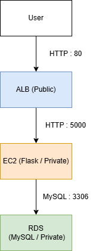

# AWS Portfolio - Flask + ALB + RDS

This is a portfolio project built using AWS services.

---

## 概要
AWSを用いて、ALB・EC2・RDSで構成されたWebアプリを構築しました。  
クラウドエンジニア志望として、インフラ構成、ネットワーク疎通、データベース接続、公開設定、障害対応まで一通り経験することを目的に作成しました。

---

## 構成

ALBを介してEC2にトラフィックを分散し、アプリケーション層とデータベース層を分離した構成としています。
User → ALB → EC2 (Flask) → RDS (MySQL)

- ALB：HTTP(80)で公開
- EC2：Flaskアプリ（port 5000）
- RDS：MySQL

---

## アプリ機能
- `/` ：投稿一覧表示
- `/add?content=xxx` ：投稿追加

---

## この構成にした理由
- EC2単体ではなく、実務に近いALB配下構成を経験するため
- RDSを使用し、アプリとDB接続を理解するため
- Security Groupによる通信制御を学ぶため

---

## 工夫した点
- EC2の5000番ポートはALBのSecurity Groupからのみ許可
- ターゲットグループのヘルスチェックを `/` に設定
- ALB経由での外部公開を実現

---

## 詰まった点と解決

### 503エラー
- 原因：ALBからEC2への通信ができていなかった
- 解決：Security Groupとアウトバウンド設定を修正

### ターゲットグループ unhealthy
- 原因：Flaskアプリの起動状態とヘルスチェック不一致
- 解決：ポート確認・起動方法修正

### AZ不一致
- 原因：ALBとEC2の配置の不整合
- 解決：ALB設定を修正し正常化

---

## 起動方法
```bash
pkill python3
nohup python3 app.py > app.log 2>&1 &
curl http://localhost:5000/
