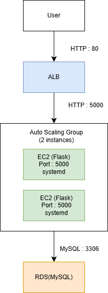

# AWS Portfolio - Flask + ALB + Auto Scaling + RDS

## 概要

AWSを用いて、ALB・EC2・RDSで構成されたWebアプリを作成しました。
最初はEC2単体で構築していましたが、1台構成ではインスタンス障害時にサービスが停止するため、ALBとAuto Scaling Groupを追加し、複数台構成に改善しました。

---

## 構成

構成は以下の通りです。

* User → ALB → EC2（Flask） → RDS（MySQL）

各コンポーネントの役割：

* ALB：HTTP(80)でリクエストを受け、EC2に振り分ける
* EC2：Flaskアプリケーションを実行（port 5000）
* RDS：データ保存用のMySQL

EC2はAuto Scaling Groupにより複数台起動する構成にしています。

---

## この構成にした理由

* EC2単体構成では障害時にサービスが停止するため
* ALBを用いた構成を理解するため
* アプリケーションとデータベースを分離した構成を試すため

---

## 工夫した点

* EC2を直接公開せず、ALB経由でのみアクセス可能にした
* Security Groupにより以下の通信のみ許可

  * ALB → EC2（5000）
  * EC2 → RDS（3306）
* Auto Scaling Groupを使用し、インスタンス数を維持する構成にした
* systemdを利用し、EC2起動時にFlaskアプリが自動起動するようにした

---

## ヘルスチェックについて

ALBのヘルスチェックは `/` に設定しています。

ポートの疎通確認だけでなく、実際にアプリにアクセスしてレスポンスが返るかを確認することで、アプリケーションが応答可能な状態かを判定しています。

---

## アプリ機能

* `/` ：投稿一覧表示
* `/add?content=xxx` ：投稿追加

---

## 詰まった点と対応

### ① 503エラー

ALBからEC2への通信ができず、503エラーが発生しました。
→ Security Groupの設定を見直して解決しました。

---

### ② ターゲットがunhealthyになる

ヘルスチェックが通らず、ターゲットがunhealthy状態になりました。
→ Flaskの起動方法やポート設定を見直して解決しました。

---

### ③ AZの設定ミス

ALBとEC2のサブネット設定が一致しておらず通信できませんでした。
→ サブネット設定を見直して修正しました。

---

## Auto Scalingの確認

EC2インスタンスを1台停止し、以下を確認しました。

* 自動で新しいインスタンスが起動されること
* ALB経由のアクセスが継続すること

これにより、インスタンス障害時でもサービスが継続される構成であることを確認しました。

---

## 学んだこと

* ALBとターゲットグループの基本的な仕組み
* Security Groupによる通信制御
* Auto Scaling Groupによるインスタンス管理
* 障害発生時の原因切り分けと対応

